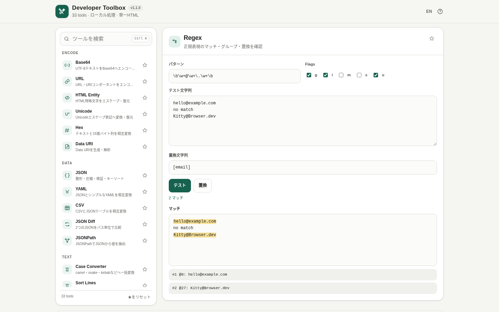

# Developer Toolbox

[](https://github.com/ttomohisa/httpapps-developer-toolbox/actions/workflows/deploy-pages.yml)
[](LICENSE)
[](https://ttomohisa.github.io/httpapps-developer-toolbox/)

[English README](README.md)

**Developer Toolbox** は、Base64、JSON、JWT、cron、正規表現、UNIX timestamp、Hash、文字列変換、Web系ユーティリティなど、開発中に「少しだけ使いたい」機能を1つの単一HTMLへまとめたローカル処理の開発者ツールボックスです。

## 🚀 Live demo

### [Developer Toolbox を GitHub Pages で開く](https://ttomohisa.github.io/httpapps-developer-toolbox/)

GitHub Pagesから最初のHTMLだけを取得します。読み込み後の変換・解析・検証・生成・Hash計算などはブラウザー内で処理され、各ツールへ入力した内容をアプリが外部へ送信することはありません。

[](https://ttomohisa.github.io/httpapps-developer-toolbox/)

## 主な機能

- 33種類の開発者向けユーティリティを1つの単一HTMLに収録
- **Smart Input** がJSON、JWT、URL、Base64、UNIX timestamp、Data URI、通常テキストなどを判定して適したツールを提案
- 結果をコピー＆ペーストせず、そのまま別ツールへ渡して続けて処理
- 各ツールの作業中入力をタブを開いている間だけメモリに保持。リロードすると消去
- Base64、URL、Unicode、Hex、px/remなどの軽量ツールはリアルタイム変換
- 対応ツールでは **「入れ替え」「コピー」「別ツールへ」** の操作を共通化
- 英語名だけでなく日本語の別名でもツール検索可能
- `Ctrl` / `⌘` + `K` のコマンドパレットとキーボード操作
- ★を付けたツールは「お気に入り」にも表示しつつ、元カテゴリにもそのまま残る
- `#base64`、`#jwt`、`#cron`、`#regex` などの直接リンク
- 日本語 / 英語UIを同じHTMLに内包
- PC / スマホ対応のレスポンシブUI
- SVG favicon内包、実行時の外部アセットなし
- 第三者ランタイムライブラリなし

## 収録ツール

| カテゴリ | ツール |
| --- | --- |
| **Encode** | Base64、URL、HTML Entity、Unicode、Hex、Data URI |
| **Data** | JSON、YAML、CSV、JSON Diff、JSONPath |
| **Text** | Case Converter、Sort Lines、Deduplicate、Character / Byte Count、Escape |
| **Time** | UNIX Timestamp、ISO 8601、Date Difference、Cron |
| **Security** | JWT Decoder、Hash、HMAC、Random Generator |
| **Developer** | Regex、UUID、URL Parser、HTTP Status、Number Base、CIDR |
| **Web** | Color Converter、px / rem、CSS Tools |

## Quick start

### Web版を使う

[GitHub Pagesのデモ](https://ttomohisa.github.io/httpapps-developer-toolbox/)を開くだけで使えます。インストールやアカウント登録は不要です。

### HTMLをダウンロードして使う

1. このリポジトリの [`dist/index.html`](https://github.com/ttomohisa/httpapps-developer-toolbox/blob/main/dist/index.html) をダウンロードします。
2. Chromium系ブラウザー、Firefox、Safariなどの現在のブラウザーで開きます。
3. 任意の場所へ保存しておけば、必要なときにそのHTMLを開くだけで利用できます。

ファイルサイズを小さくして配布したい場合は、同じアプリをgzip圧縮して内包した [`dist/index.self-extract.html`](https://github.com/ttomohisa/httpapps-developer-toolbox/blob/main/dist/index.self-extract.html) も利用できます。

### 完全オフライン版をビルドする（上級者向け）

1. このリポジトリをダウンロードまたはcloneします。
2. Windows 10/11で `build-standalone.bat` をダブルクリックします。
3. `dist/index.html` と自己解凍版が生成・検証されます。
4. 生成したHTMLを任意の場所へコピーします。
5. 以降はWebサーバーなしで、そのHTMLを直接開いて使えます。

Python、Node.js、ローカルWebサーバーは不要です。ビルダーはWindows PowerShellと標準の `tar.exe` を使用します。現時点では第三者ランタイム依存もありません。

## 使い方

1. **Smart Input** へ値を貼り付けるか、PC左側の一覧 / スマホのツール選択画面から使いたい機能を開きます。
2. 処理したい値を入力または貼り付けます。
3. 軽量ツールは自動変換され、それ以外は **解析・比較・計算・生成** などのボタンで処理します。
4. 結果をコピーするほか、対応ツールでは入力と結果を **「入れ替え」** たり、**「別ツールへ」** からそのまま次の処理へ渡せます。
5. よく使うツールには★を付けると **「お気に入り」** にも表示されます。
6. ツールを切り替えても、このタブを開いている間は作業中の入力がメモリに残るため、戻って続きから作業できます。

### コマンドパレット / キーボード操作

| ショートカット | 操作 |
| --- | --- |
| `Ctrl` / `⌘` + `K` | ツール検索パレットを開く |
| `↑` / `↓` | 検索結果を移動 |
| `Enter` | 選択中のツールを開く |
| `Esc` | 検索文字をクリア、またはパレットを閉じる |

`regex` / `正規表現`、`hash` / `ハッシュ`、`CIDR` / `サブネット` のように、英語名と日本語の別名のどちらでも検索できます。

## GitHub Pagesで公開する

このリポジトリには、単一HTMLをビルド・検証して `dist/` をGitHub Pagesへ自動デプロイするWorkflowを含めています。

1. GitHubへ `httpapps-developer-toolbox` としてpushします。
2. **Settings → Pages → Build and deployment → Source** で **GitHub Actions** を選択します。
3. `main` へpushするか、Actionsから **Deploy standalone app to GitHub Pages** を手動実行します。
4. デプロイ完了後、`https://ttomohisa.github.io/httpapps-developer-toolbox/` で利用できます。

`main` へのpushでは、デプロイ前にリポジトリ検証を実行します。アプリ本体やビルド関連ファイルを変更するPull Requestでも、単一HTMLのビルド検証Workflowが実行されます。

## 開発・ビルド構成

```text
.
├─ src/index.template.html       # アプリ本体のソーステンプレート
├─ app.config.json               # アプリ名・バージョン・リポジトリ・ビルド設定
├─ dependencies.json             # 内包依存の固定設定（現在は空）
├─ build-standalone.bat          # Windows用ビルド入口
├─ build-standalone.ps1          # 単一HTMLビルダー
├─ scripts/
│  ├─ check-repository.ps1       # リポジトリ全体のビルド・検証
│  ├─ verify-standalone.ps1      # 通常版HTMLの検証
│  ├─ build-self-extract.ps1     # 自己解凍版の生成
│  └─ verify-self-extract.ps1    # 自己解凍版の検証
├─ dist/
│  ├─ index.html                 # 可読な単一HTMLリリース
│  ├─ index.self-extract.html    # gzip自己解凍版
│  ├─ dependency-manifest.json
│  └─ self-extract-manifest.json
└─ .github/workflows/
   ├─ build-standalone.yml       # Pull Request時のビルド検証
   └─ deploy-pages.yml           # mainからGitHub Pagesへ自動公開
```

生成済みの `dist/` を直接編集せず、`src/index.template.html` を変更して再ビルドしてください。製品仕様と受入条件は [APP_SPEC.md](APP_SPEC.md) にまとめています。

### ビルドと検証

通常のビルド：

```bat
build-standalone.bat
```

GitHub Actionsと同等のリポジトリ全体チェック：

```powershell
./scripts/check-repository.ps1
```

ビルド・検証では次を自動で行います。

- `src/index.template.html` から単一HTMLを生成
- `dependencies.json` に依存が設定されている場合はアセットをHTMLへ内包
- 未置換プレースホルダーや不正なビルド結果を検出
- 実行時に外部リソースへ依存していないことを検証
- dependency manifest / self-extract manifestを生成
- gzip自己解凍版を生成
- 自己解凍した内容が通常版HTMLとbyte単位で一致することを検証

## プライバシーと実行時通信

Developer Toolboxは、ユーティリティへ入力したデータを端末内で処理する前提で設計しています。

- Content Security Policyに `connect-src 'none'` を設定
- Analytics / Telemetryなし
- 実行時の外部Script、Stylesheet、API、CDNなし
- Smart Inputや各ツールの入力・出力を `localStorage` へ保存しない
- 作業中のツール状態はメモリ上だけに保持し、リロードまたはタブを閉じると消去
- 永続保存するのは言語設定とお気に入りのツールIDのみ
- Hash計算で選択したファイルもブラウザー内だけで処理

GitHub Pages版は最初にHTMLを取得するための通信だけ必要です。HTML読み込み後の各ユーティリティ処理に実行時ネットワーク接続は不要です。ネットワークを完全に切った状態で使う場合は、`dist/index.html` をローカルで直接開いてください。

セキュリティ方針は [SECURITY.md](SECURITY.md)、オフライン確認手順は [VERIFY_OFFLINE.md](VERIFY_OFFLINE.md) を参照してください。

## 制限事項

- JWT DecoderはHeader / Payloadをデコードしますが、署名の正当性は検証しません。
- Cronは一般的な5フィールド形式を対象とし、次回実行は端末のローカルタイムゾーンで計算します。実際のcron実装とは差が出る場合があります。
- JSONPathは完全仕様ではなく、軽量なサブセット実装です。
- YAML Parserは小規模な変換用途向けの簡易サブセット実装です。
- ファイルHashは選択したファイル全体をブラウザーのメモリへ読み込むため、非常に大きなファイルではメモリ使用量が増えます。
- 自己解凍版には `DecompressionStream` 対応ブラウザーが必要です。
- 作業中の入力は意図的に永続保存しないため、ページをリロードすると消えます。

## 依存関係

現在のリリースには **第三者ランタイムライブラリはありません**。`dependencies.json` は空で、Web Crypto、`TextEncoder`、`URL`、`Intl` などのブラウザー標準APIを利用しています。

将来、本当に必要なツールが追加された場合に備えて、ビルドシステム自体はバージョン固定した依存を単一HTMLへ内包できる構成を維持しています。依存ポリシーは [THIRD_PARTY_NOTICES.md](THIRD_PARTY_NOTICES.md) と [docs/DEPENDENCIES.md](docs/DEPENDENCIES.md) を参照してください。

## Contributing

バグ報告や機能提案はGitHub Issuesから歓迎します。開発時のルールは [CONTRIBUTING.md](CONTRIBUTING.md) を参照してください。

## License

Copyright © 2026 ttomohisa

[MIT License](LICENSE) で公開しています。
